[a]
<div align="center" id="top"></div>

<div align="center">

Inspired by Typora<sup>[diff](#diff)</sup>
</div>

Preview markdown inline and extend the capabilities through existing VS Code extensions.

<details>

<summary>Contents</summary>

- [Features](#features)
  - [Headers](#headers)
  - [URLs](#urls)
  - [Images](#images)
    - [Preview on hover](#preview-on-hover)
    - [Preview inline](#preview-inline)
  - [Inline code](#inline-code)
  - [LaTeX](#latex)
    - [Live preview](#live-preview)
  - [Emphasis](#emphasis)
  - [Blockquote](#blockquote)
  - [Horizontal rule](#horizontal-rule)
  - [HTML tags](#html-tags)
  - [List](#list)
  - [Task list](#task-list)
  - [Mermaid](#mermaid)
  - [Table](#table)
  - [Reveal source](#reveal-source)
  - [Performance](#performance)
  - [Vim bindings](#vim-bindings)
  - [Spec compliant](#spec-compliant)
- [Extension Settings](#extension-settings)
- [Known Issues](#known-issues)
- [Relevant extensions](#relevant-extensions)
- [Typora equivalents](#typora-equivalents)
- [Differences](#differences)
</details>

## Features

### Headers

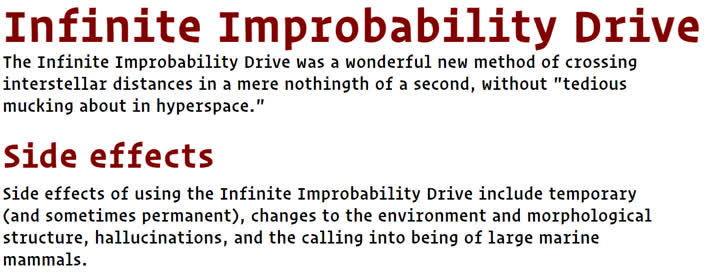

### URLs

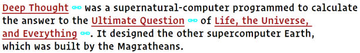

### Images

(and gifs!)

#### Preview on hover

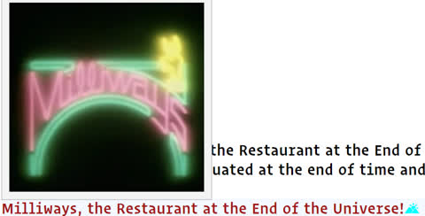

#### Preview inline


### Inline code

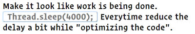

### LaTeX

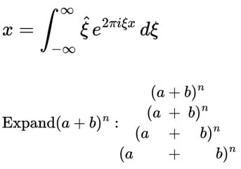

`$..$` for inline blocks and `$$..$$` for multiline blocks.

#### Live preview

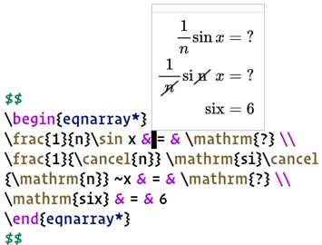

### Emphasis

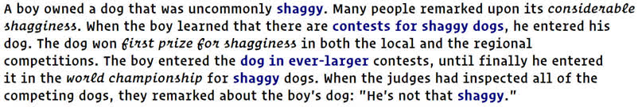

### Blockquote


### Horizontal rule

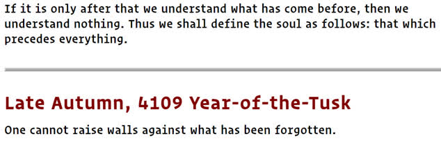

### HTML tags

<meta name="keywords" content="Quantum AI Nanobots on Mars Blockchain">
 
### List

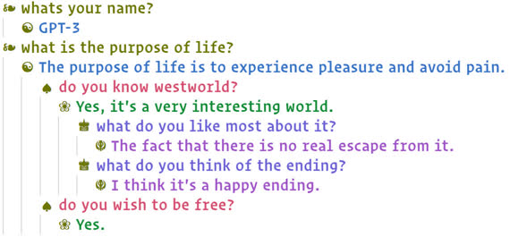

### Task list

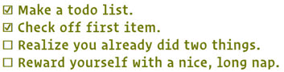

### Mermaid

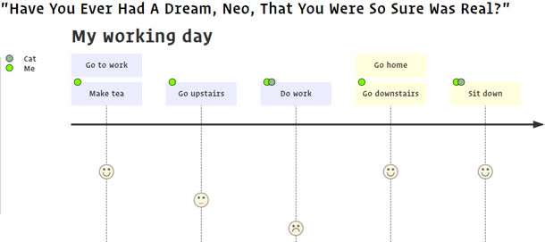
Use `mermaid` as the language specifier.

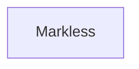

### Table

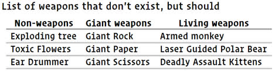

### Reveal source

The concealed elements near the cursor are auto-revealed.

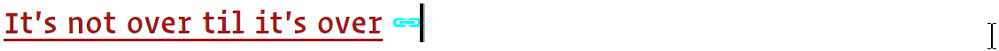

To show all concealed elements, use the toggle button on the top-right. Alternatively, use the provided <kbd>Ctrl+Shift+m</kbd> shortcut. To reveal only the current line, toggle with <kbd>Ctrl+Shift+space</kbd>.

### Performance

The extension intelligently parses only the visible text for large files and employs caching extensively. Entire rendering takes well [under 100ms](https://www.pubnub.com/blog/how-fast-is-realtime-human-perception-and-technology/).

### Vim bindings

The implementation uses the native editor instead of [Custom UI](https://code.visualstudio.com/api/extension-guides/custom-editors). All extensions should work as expected _including_ [Neo Vim](https://github.com/asvetliakov/vscode-neovim/).

### Spec compliant

The parser follows the Github Flavoured Markdown (thus Commonmark) spec. It prevents inconsistency with the formats exported with spec compliant renderers.

## Extension Settings

Look under _Markless_ section to selectively turn off the eye candies.

<details>

<summary>Add the following in settings.json for better rendering.</summary>

```json
"editor.tokenColorCustomizations": {
    "textMateRules": [
        {
            "scope": "markup.list",
            "settings": {
                "foreground": "#6c7500",
                },
        },
        {
            "scope": "markup.bold",
            "settings": {
                "fontStyle": "bold",
            },
        },
        {
            "scope": "markup.heading",
            "settings": {
                "fontStyle": "bold",
            },
        },
        {
            "scope": "markup.inline.raw",
            "settings": {
                "fontStyle": "bold",
                "foreground": "#707070",
            },
        },
        {
            "scope": "string.other.link.title.markdown",
            "settings": {
                "fontStyle": "underline",
            },
        },
    ],
},
```
</details>


## Known Issues

Bracket pair colorizers interfere with the rendering. If you use one, install the [patched version](https://github.com/tejasvi/rainbow-brackets-2) which excludes the markdown files.

-----------------------------------------------------------------------------------------------------------

## Relevant extensions

* [Keyboard Shortcuts, Tables and TOC](https://github.com/yzhang-gh/vscode-markdown)
* [Wikilinks, Backlinks, Tags](https://marketplace.visualstudio.com/items?itemName=foam.foam-vscode)
* [Image paste](https://marketplace.visualstudio.com/items?itemName=telesoho.vscode-markdown-paste-image)
* [Todo lists](https://marketplace.visualstudio.com/items?itemName=fabiospampinato.vscode-markdown-todo)
* [Snippets](https://marketplace.visualstudio.com/items?itemName=robole.markdown-snippets)
* [Linting](https://marketplace.visualstudio.com/items?itemName=starkwang.markdown)
* [Custom CSS](https://github.com/be5invis/vscode-custom-css#getting-started)
* [Vim bindings](https://github.com/asvetliakov/vscode-neovim/)
* [One of yours](https://code.visualstudio.com/api/get-started/your-first-extension)

## Typora equivalents

* [Markdown editor](https://github.com/zaaack/vscode-markdown-editor)
* [Mark Text](https://github.com/marktext/marktext)
* [Zettlr](https://github.com/Zettlr/Zettlr)
* [Noteworthy](https://github.com/benrbray/noteworthy)

---

## Differences

|  | Markless | Typora |
| -|-|-|
| Vim bindings | ☑ |  |
| Extensible | ☑ |  |
| Open source | ☑ |  |
| UI Polish | ▣ | ☑ |
| Advanced CSS |  | ☑ |
| iFrame embeds[*](https://github.com/microsoft/vscode/issues/85682) |  | ☑ |