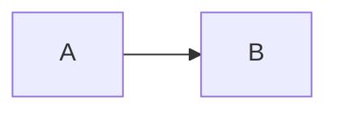
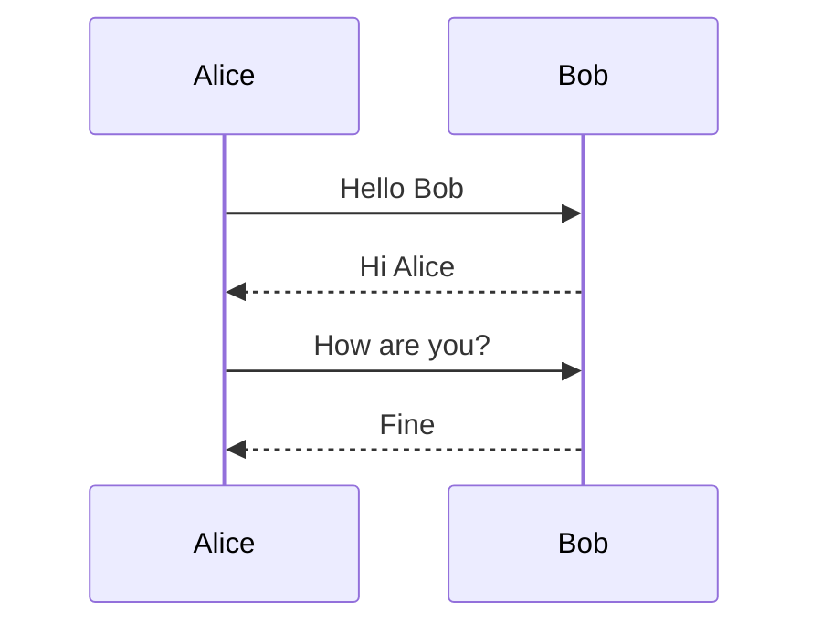
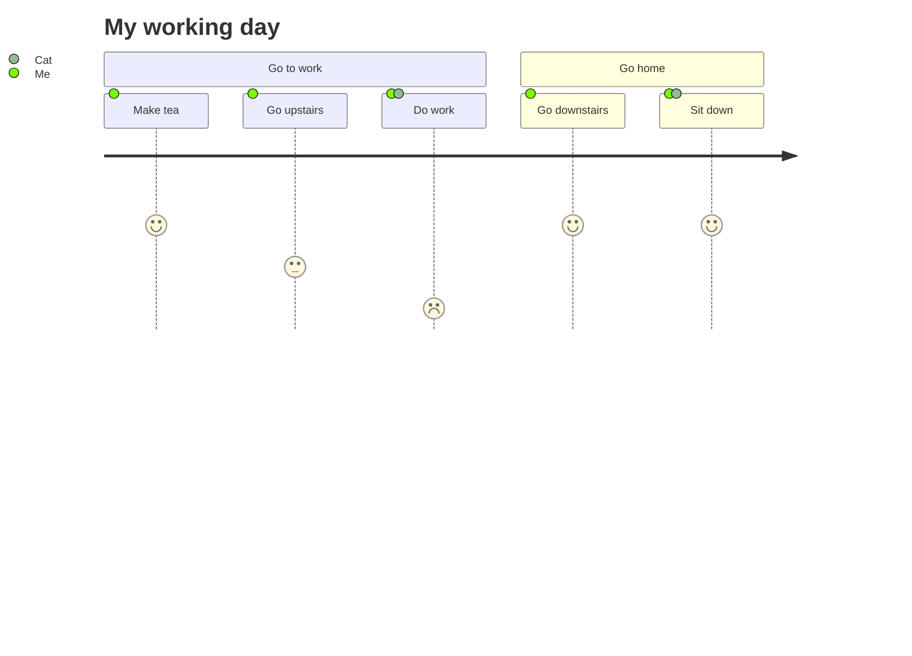
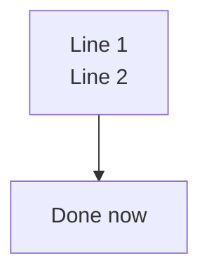

# Diagrams

```mermaid
graph LR
  A --> B
```

Between the diagrams.

```mermaid
sequenceDiagram
  Alice->>Bob: Hello Bob
  Bob-->>Alice: Hi Alice
  Alice->>Bob: How are you?
  Bob-->>Alice: Fine
```

```mermaid
journey
  title My working day
  section Go to work
    Make tea: 5: Me
    Go upstairs: 3: Me
    Do work: 1: Me, Cat
  section Go home
    Go downstairs: 5: Me
    Sit down: 5: Me, Cat
```

```mermaid
graph TD
  A[Line 1<br>Line 2] --> B[Done&nbsp;now]
```

```mermaid
graph TD
  this is not valid -->
```

The end.
